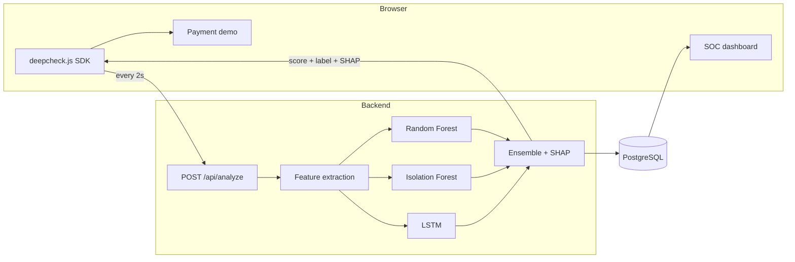

# DeepCheck

**Real-time behavioral bot detection for online payments.**

DeepCheck tells humans and bots apart by *how they behave* — mouse trajectories, typing rhythm, scroll patterns, hesitation — and returns an explainable 0–100 risk score while the user is still on the page. No CAPTCHAs, no puzzles, no friction for real customers.

Built for the **Teknofest Financial Technologies Competition**.

```
Genuine user  →  12.4  →  payment proceeds silently
Bot detected  →  94.1  →  session blocked, with the reasons attached
```

---

## The problem

Payment fraud is automated. Bots run card testing, credential stuffing and checkout abuse at a scale no manual review can match, and modern automation mimics human behavior well enough to walk past traditional defenses. The usual countermeasure — CAPTCHAs and static rule engines — punishes the wrong people: real customers get puzzles and drop out of the funnel, while the bots that matter solve them anyway.

## The approach

Behavior is expensive to fake convincingly and free to observe. DeepCheck watches *how* an interaction happens rather than *who* claims to be doing it, so verification costs a legitimate user exactly nothing — they never know it ran.

Three properties make it usable in a payment flow rather than just a lab:

- **Invisible.** One script tag. Nothing is shown to the user, nothing is asked of them.
- **Explainable.** Every score carries its SHAP feature attribution, so a fraud analyst — or a regulator — can see *why* a session was flagged instead of trusting a black box.
- **Privacy-preserving.** The SDK records keystroke *timing* only. Never key content, never field values, never card data. Nothing sensitive leaves the page.

---

## Architecture



The SDK keeps a 10-second rolling window of behavior and flushes every 2 seconds, so a couple of quiet seconds — a user typing without moving the mouse — doesn't blank out the signal.

---

## Quick start

```bash
docker-compose up --build
```

That's the whole thing. On first run the backend trains the models automatically (a few minutes — the model binaries are deliberately not committed, see [Model artifacts](#model-artifacts)).

| Surface | URL |
|---|---|
| Payment demo | http://localhost:3000/demo |
| SOC dashboard | http://localhost:3000/dashboard |
| API | http://localhost:8000 |

To train the models ahead of time and skip the wait on first boot:

```bash
cd backend && python train_model.py
```

---

## How the scoring works

Six behavioral features are extracted from each flush, every one normalized to roughly 0–1:

| Feature | What it measures |
|---|---|
| `scroll_hizi_varyansi` | Variance in scroll speed — humans accelerate and hesitate, scripts don't |
| `tereddut_skoru` | Average pause before acting; genuine hesitation before committing |
| `etkilesim_entropisi` | Regularity of event spacing, measured **per input channel** |
| `ivme_degisimi` | Variance of mouse *acceleration*, not just speed |
| `tiklama_yogunlugu` | Click density inside the most recent 5-second window |
| `odak_degisimi` | How often the tab lost focus |

Interaction entropy is computed per channel and then combined, rather than by merging every timestamp into one stream first. Merging is the obvious implementation and it is wrong: interleaving several independently-regular channels produces a sequence that looks irregular even when each channel is perfectly robotic on its own — a beat-frequency artifact that measured ~0.92 entropy for three channels that individually scored 0.0.

Those six features feed three models whose outputs are blended:

```
fraud_probability = 0.5 × RandomForest + 0.2 × IsolationForest + 0.3 × LSTM
risk_score        = 100 × fraud_probability
```

The Isolation Forest is trained only on human behavior, so it flags anomalies rather than learning a bot signature — which matters for automation that doesn't resemble anything in the training set.

A session's reported score is the **median of its last 5 flushes**, not the instantaneous value. One incidental pause in an otherwise robotic session shouldn't flip the verdict; an anomaly has to persist to move it.

### Risk bands

| Score | Label | Action |
|---|---|---|
| 0–40 | Gerçek Kullanıcı | No intervention |
| 40–60 | Şüpheli | Warning shown |
| 60–80 | Yüksek Risk | Step-up verification |
| 80–100 | Bot Tespit Edildi | Session blocked |

---

## API

**`POST /api/analyze`** — submit a behavior window, get a score back.

```json
{
  "session_id": "8f14e45f-ceea-467a-9f8c-2b1c3d4e5f6a",
  "risk_score": 73.4,
  "label": "Yüksek Risk",
  "confidence": 0.91,
  "shap_explanation": [
    { "feature": "etkilesim_entropisi", "value": 0.12, "impact": 28.3 },
    { "feature": "tereddut_skoru",      "value": 0.00, "impact": 24.1 },
    { "feature": "ivme_degisimi",       "value": 0.98, "impact": 19.7 }
  ],
  "response_time_ms": 42.1
}
```

| Endpoint | Purpose |
|---|---|
| `POST /api/analyze` | Score a behavior window |
| `GET /api/score/{session_id}` | Full history for one session |
| `GET /api/sessions` | All sessions, for the dashboard |
| `GET /api/health` | Service and model status |

### SDK usage

```html
<script src="/deepcheck.js"></script>
<script>
  DeepCheck.init({
    apiUrl: "http://localhost:8000",
    intervalMs: 2000,
    onUpdate: (result) => {
      // { risk_score, label, confidence, shap_explanation }
      gateCheckout(result.risk_score);
    },
  });
</script>
```

---

## Performance

Measured on a development machine against the shipped models, 60 runs after warm-up:

| Metric | Value |
|---|---|
| Mean | 42.4 ms |
| p50 | 42.3 ms |
| p95 | 44.3 ms |
| p99 | 47.1 ms |

This is **model scoring time** — feature extraction, all three models, and SHAP attribution. It excludes the database write and network transit, so it is not an end-to-end figure. Measure your own deployment before quoting a number.

---

## Testing

```bash
cd backend && python test_scorer.py
```

Seven regression tests, each one a bug that actually happened and must not come back — a sparse typing session that used to be scored as high-risk, a bot that evaded detection by pausing once, a keyboard-injection session that scored as human. They assert *behavior* rather than exact values, so a change to a feature formula or the training distribution fails loudly instead of silently degrading detection.

Training and inference share the same `extract_features()` code path: `train_model.py` simulates raw sessions and pushes them through the identical extraction used at serving time, so a change to a feature formula flows into the training data automatically and cannot drift apart.

---

## Project structure

```
deepcheck/
├── sdk/deepcheck.js          Browser SDK — behavioral collection
├── backend/
│   ├── main.py               FastAPI endpoints
│   ├── scorer.py             Feature extraction, ensemble, SHAP
│   ├── lstm_model.py         PyTorch sequence model
│   ├── train_model.py        Synthetic data generation + training
│   ├── test_scorer.py        Behavioral regression tests
│   └── models.py             SQLAlchemy schema
├── frontend/src/
│   ├── pages/Demo.jsx        Payment demo with live scoring
│   └── pages/Dashboard.jsx   SOC dashboard, D3 charts
└── landing/index.html        Product landing page
```

**Stack:** FastAPI · PostgreSQL · scikit-learn · PyTorch · SHAP · React · Vite · Tailwind · D3

---

## Model artifacts

`model.pkl` and `lstm_model.pt` are **not committed**. They are regenerated by `train_model.py` (fixed seed, reproducible), `entrypoint.sh` builds them automatically if missing, and a ~10 MB binary in git history is permanent weight. Pickles are also version-fragile — they must be loaded by the same scikit-learn version that wrote them, so pinning the training environment matters more than shipping the file. See `backend/requirements.txt`.

Training generates 50,000 synthetic sessions across four personas — natural humans, rushed-but-genuine humans, naive scripts, and human-mimicking bots — with 10% cross-contamination so the two classes are not trivially separable.

---

## Project status

This is a **competition MVP**, and worth reading as one.

The detection pipeline, the SDK, and both interfaces work end to end and are what you see running. Current models are trained on synthetic behavior, so reported separation reflects the quality of that simulation rather than measured performance against real traffic — collecting labeled sessions from real users and off-the-shelf automation frameworks is the next substantive step, and no accuracy claim here should be taken as a production benchmark until then.

The deployment is likewise sized for demonstration rather than production: hardening the API surface, moving risk enforcement fully server-side, and adding rate limiting are tracked work, not oversights.

---

## Deployment

**Primary, tested path: Docker Compose + Uvicorn.**

```bash
docker-compose up --build
```

Runs `main.py` under Uvicorn via `backend/entrypoint.sh` and `backend/Dockerfile`. This is the configuration the demo and dashboard are verified against.

**Optional: AWS Lambda.**

`backend/lambda_handler.py` (Mangum adapter) and `backend/template.yaml` (AWS SAM) host the same FastAPI app behind API Gateway:

```bash
cd backend && sam build --use-container && sam deploy --guided
```

This path is **present as code but not deployed or tested** in this repository. A real Lambda deployment needs container-image packaging (torch + shap exceed the zip size limit) and a `DATABASE_URL` pointing at a reachable Postgres instance such as RDS or Aurora — there is no bundled database on Lambda.

---

## Contact

**Huseyn Huseynov** · [hhuseynov0707@gmail.com](mailto:hhuseynov0707@gmail.com) · Baku, Azerbaijan
