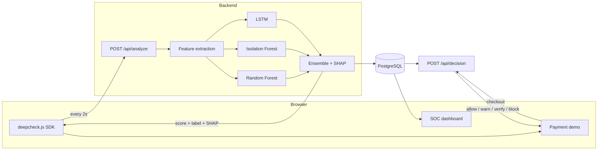

# DeepCheck

**Real-time behavioral bot detection for online payments.**

DeepCheck tells humans and bots apart by *how they behave* — mouse trajectories, typing rhythm, scroll patterns, hesitation — and returns an explainable 0–100 risk score while the user is still on the page. No CAPTCHAs, no puzzles, no friction for real customers.

Built for the **Teknofest Financial Technologies Competition**.

```
Genuine user  →  12.4  →  payment proceeds silently
Bot detected  →  94.1  →  session blocked, with the reasons attached
```

---

## The problem

Payment fraud is automated. Bots run card testing, credential stuffing and checkout abuse at a scale no manual review can match, and modern automation mimics human behavior well enough to walk past traditional defenses. The usual countermeasure — CAPTCHAs and static rule engines — punishes the wrong people: real customers get puzzles and drop out of the funnel, while the bots that matter solve them anyway.

## The approach

Behavior is expensive to fake convincingly and free to observe. DeepCheck watches *how* an interaction happens rather than *who* claims to be doing it, so verification costs a legitimate user exactly nothing — they never know it ran.

Three properties make it usable in a payment flow rather than just a lab:

- **Invisible.** One script tag. Nothing is shown to the user, nothing is asked of them.
- **Explainable.** Every score carries its SHAP feature attribution, so a fraud analyst — or a regulator — can see *why* a session was flagged instead of trusting a black box.
- **Privacy-preserving.** The SDK records keystroke *timing* only. Never key content, never field values, never card data. Nothing sensitive leaves the page.

---

## Architecture



The score the browser sees is for display. The decision that gates a payment is made by `POST /api/decision` on the server, from the score stored in Postgres — a control in the browser is a control the attacker can edit.

The SDK keeps a 10-second rolling window of behavior and flushes every 2 seconds, so a couple of quiet seconds — a user typing without moving the mouse — doesn't blank out the signal.

---

## Quick start

```bash
docker-compose up --build
```

That's the whole thing. On first run the backend trains the models automatically (4–8 minutes, and it says so on the console — the model binaries are deliberately not committed, see [Model artifacts](#model-artifacts)).

| Surface | URL |
|---|---|
| Payment demo | http://localhost:3000/demo |
| SOC dashboard | http://localhost:3000/dashboard |
| API | http://localhost:8000 |

To train the models ahead of time and skip the wait on first boot:

```bash
cd backend && python train_model.py
```

---

## How the scoring works

Six behavioral features are extracted from each flush, every one normalized to roughly 0–1:

| Feature | What it measures |
|---|---|
| `scroll_hizi_varyansi` | Variance in scroll speed — humans accelerate and hesitate, scripts don't |
| `tereddut_skoru` | Average pause before acting; genuine hesitation before committing |
| `etkilesim_entropisi` | Regularity of event spacing, measured **per input channel** |
| `ivme_degisimi` | Variance of mouse *acceleration*, not just speed |
| `tiklama_yogunlugu` | Click density inside the most recent 5-second window |
| `odak_degisimi` | How often the tab lost focus |

Interaction entropy is computed per channel and then combined, rather than by merging every timestamp into one stream first. Merging is the obvious implementation and it is wrong: interleaving several independently-regular channels produces a sequence that looks irregular even when each channel is perfectly robotic on its own — a beat-frequency artifact that measured ~0.92 entropy for three channels that individually scored 0.0.

Those six features feed three models whose outputs are blended:

```
fraud_probability = 0.5 × RandomForest + 0.2 × IsolationForest + 0.3 × LSTM
risk_score        = 100 × fraud_probability
```

The Isolation Forest is trained only on human behavior, so it flags anomalies rather than learning a bot signature — which matters for automation that doesn't resemble anything in the training set.

A session's reported score is the **median of its last 5 flushes**, not the instantaneous value. One incidental pause in an otherwise robotic session shouldn't flip the verdict; an anomaly has to persist to move it.

### Risk bands

| Score | Label | Action |
|---|---|---|
| 0–40 | Gerçek Kullanıcı | No intervention |
| 40–60 | Şüpheli | Warning shown |
| 60–80 | Yüksek Risk | Step-up verification |
| 80–100 | Bot Tespit Edildi | Session blocked |

---

## API

**`POST /api/analyze`** — submit a behavior window, get a score back.

```json
{
  "session_id": "8f14e45f-ceea-467a-9f8c-2b1c3d4e5f6a",
  "risk_score": 73.4,
  "label": "Yüksek Risk",
  "confidence": 0.91,
  "shap_explanation": [
    { "feature": "etkilesim_entropisi", "value": 0.12, "impact": 28.3 },
    { "feature": "tereddut_skoru",      "value": 0.00, "impact": 24.1 },
    { "feature": "ivme_degisimi",       "value": 0.98, "impact": 19.7 }
  ],
  "response_time_ms": 42.1
}
```

| Endpoint | Auth | Purpose |
|---|---|---|
| `POST /api/session` | — | Mint a session id and its signed token |
| `POST /api/analyze` | `X-DeepCheck-Token` | Score a behavior window |
| `POST /api/decision` | `X-DeepCheck-Token` | **The enforcement point.** Returns the action to take and why |
| `POST /api/demo/charge` | `X-DeepCheck-Token` | Demo merchant backend: applies the decision and charges, or declines |
| `POST /api/demo/verify` | `X-DeepCheck-Token` | Demo step-up: records a successful verification on the server |
| `GET /api/score/{session_id}` | `X-Dashboard-Key` | Full history for one session |
| `GET /api/sessions` | `X-Dashboard-Key` | All sessions, for the dashboard |
| `GET /api/health` | — | Service and model status |

Session ids are minted server-side and signed with HMAC-SHA256 over
`DEEPCHECK_SECRET`. A client can hold a token but cannot mint one, so
telemetry cannot be posted under a session id its sender was not given. The
SOC endpoints expose every customer's live session and are behind a separate
key.

**Replay protection.** `/api/analyze` rejects (422) a flush whose newest event
is more than 15 s from the server clock, a flush whose time runs backwards
within its session, and any telemetry whose clock-independent fingerprint
(timestamps rebased before hashing) has been seen before in *any* session. A
recording of a real person cannot be replayed under a fresh token, with or
without its timestamps rewritten.

**Evidence before a verdict.** `/api/decision` answers `verify` until at least
3 flushes (6 s of behaviour) have been analysed and while the session's last
flush is older than 30 s. One plausible window is cheap to fabricate; six
seconds of sustained behaviour is not, and a verdict must be about behaviour
that is happening now.

**Rate limits.** Per IP for minting (20/min) and per session for scoring
(60/min) and checkout (20/min), returning 429 with `Retry-After`. Scoring is
keyed by session rather than by address on purpose: a demo stand or an office
puts many genuine users behind one IP. Counters live in each worker's memory,
so with the default 4 workers the effective ceiling is up to 4x these numbers;
a shared backend is the upgrade path for more than one host.

**Retention.** Raw telemetry is blanked after an hour and whole rows deleted
after a day, by a sweep that runs every 10 minutes under a Postgres advisory
lock so only one worker does the work. The six features and the score survive
the first stage, so the dashboard history keeps working.

### SDK usage

```html
<script src="/deepcheck.js"></script>
<script>
  DeepCheck.init({
    apiUrl: "http://localhost:8000",
    intervalMs: 2000,
    onUpdate: (result) => {
      // { risk_score, label, confidence, shap_explanation }
      // Display only. Never gate a payment on this value — see Entegrasyon.
      showRiskBadge(result.risk_score);
    },
  });
</script>
```

`DeepCheck.getSessionId()` and `DeepCheck.getToken()` return what the checkout
call needs; `DeepCheck.ready()` resolves once the server has minted the
session.

---

## Entegrasyon

Bir bankanın veya e-ticaret sitesinin DeepCheck'i devreye alması üç adımdır.

**1. SDK'yı sayfaya ekleyin.**

```html
<script src="https://<host>/deepcheck.js"></script>
```

**2. Oturumu başlatın.** Oturum kimliği ve imzalı jeton sunucudan gelir;
SDK bunu kendisi ister ve her akışta `X-DeepCheck-Token` başlığıyla gönderir.

```html
<script>
  DeepCheck.init({ apiUrl: "https://<host>" });
</script>
```

**3. Ödeme anında kararı SUNUCUNUZDAN alın ve uygulayın.** Tarayıcı, ödeme
isteğiyle birlikte `DeepCheck.getSessionId()` ve `DeepCheck.getToken()`
değerlerini kendi arka ucunuza gönderir; kararı arka ucunuz ister ve ödeme
sağlayıcısını yalnızca `allow` veya `warn` geldiğinde çağırır. Risk skorunu
tarayıcıda karşılaştırmayın ve ödemeyi tarayıcıdan başlatmayın: tarayıcıdaki
her kontrol saldırganın düzenleyebileceği bir kontroldür. Bu depodaki
`POST /api/demo/charge` bu deseni küçük ölçekte gösterir — karar ve tahsilat
aynı sunucu çağrısında yapılır, sayfada hiçbir koşul yoktur.

```js
// Merchant backend (Node örneği) — tarayıcıdan gelen session_id ve token ile
const res = await fetch("https://<host>/api/decision", {
  method: "POST",
  headers: {
    "Content-Type": "application/json",
    "X-DeepCheck-Token": token,
  },
  body: JSON.stringify({ session_id }),
});
const decision = await res.json();
if (decision.action === "allow" || decision.action === "warn") {
  await paymentProvider.charge(order);
}
```

```json
{
  "action": "verify",
  "risk_score": 73.4,
  "label": "Yüksek Risk",
  "message": "Ek dogrulama gerekli",
  "reason": "score"
}
```

`reason` kararın nedenini söyler: `score` (eşik), `insufficient_evidence`
(henüz 3 akıştan az davranış var — kullanıcıya "birkaç saniye sonra tekrar
deneyin" gösterin, OTP istemeyin), `stale` (son akış 30 saniyeden eski),
`unknown_session`, `verified` (ek doğrulama sunucuda kaydedilmiş ve `verify`
kararını `allow`a yükseltmiş).

**Ek doğrulama** sonucu tarayıcıda değil sunucuda tutulur: demo'daki
`POST /api/demo/verify` kodu doğrular ve oturuma yazar, sonraki `charge`
çağrısı bunu okur. Gerçek entegrasyonda bu adım SMS / 3-D Secure
sağlayıcınızdır. Doğrulama yalnızca `verify` kararını yükseltir; `block`
kararı hiçbir kodla aşılamaz.

| `action` | Skor | Etiket | Yapılması gereken |
|---|---|---|---|
| `allow` | 0–40 | Gerçek Kullanıcı | Ödemeyi işleyin, kullanıcı hiçbir şey görmez |
| `warn` | 40–60 | Şüpheli | Ödemeyi işleyin, uyarı gösterin |
| `verify` | 60–80 | Yüksek Risk | Ek doğrulama isteyin (SMS, 3-D Secure) |
| `block` | 80–100 | Bot Tespit Edildi | Ödemeyi reddedin |

Karar alınamazsa (ağ hatası, kayıtsız oturum, hiç telemetri göndermemiş bir
istemci) yanıt `verify` olur — asla `allow`. Skorun yokluğu masumiyet kanıtı
değildir; SDK'yı hiç çalıştırmayan bir istemcinin durumu tam olarak budur.

---

## Performance

Measured on a development machine against the shipped models, 60 runs after warm-up:

| Metric | Value |
|---|---|
| Mean | 42.4 ms |
| p50 | 42.3 ms |
| p95 | 44.3 ms |
| p99 | 47.1 ms |

This is **model scoring time** — feature extraction, all three models, and SHAP attribution. It excludes the database write and network transit, so it is not an end-to-end figure. Measure your own deployment before quoting a number.

---

## Testing

```bash
cd backend && python test_scorer.py
```

Twelve regression tests, each one a bug that actually happened and must not come back — a sparse typing session scored as high-risk, a bot that evaded detection by pausing once, a keyboard-injection session that scored as human, a checkout that was approved because the score never arrived. They assert *behavior* rather than exact values, so a change to a feature formula or the training distribution fails loudly instead of silently degrading detection.

The API tests run against a stub database rather than Postgres, deliberately: an authorization check that needs infrastructure to test is an authorization check that stops being tested.

Training and inference share the same `extract_features()` code path: `train_model.py` simulates raw sessions and pushes them through the identical extraction used at serving time, so a change to a feature formula flows into the training data automatically and cannot drift apart.

Measuring against real people is a separate question, and an open one — see [docs/evaluation.md](docs/evaluation.md).

---

## Project structure

```
deepcheck/
├── sdk/deepcheck.js          Browser SDK — behavioral collection
├── backend/
│   ├── main.py               FastAPI endpoints
│   ├── scorer.py             Feature extraction, ensemble, SHAP
│   ├── lstm_model.py         PyTorch sequence model
│   ├── train_model.py        Synthetic data generation + training
│   ├── test_scorer.py        Behavioral regression tests
│   └── models.py             SQLAlchemy schema
├── frontend/src/
│   ├── pages/Demo.jsx        Payment demo with live scoring
│   └── pages/Dashboard.jsx   SOC dashboard, D3 charts
└── docs/index.html           Product landing page (served by GitHub Pages)
```

**Stack:** FastAPI · PostgreSQL · scikit-learn · PyTorch · SHAP · React · Vite · Tailwind · D3

---

## Model artifacts

The artifacts are **not committed**: they are regenerated by `train_model.py`, `entrypoint.sh` builds them automatically when they are missing or unusable, and a ~10 MB binary in git history is permanent weight.

They are named for the scikit-learn that wrote them — `model-sklearn1.5.0.pkl`, `lstm_model-sklearn1.5.0.pt`. A pickle is only safely loadable by the version that produced it; loading one written by another version makes scikit-learn print a warning about "possibly invalid results" and then score anyway. That is not a hypothetical here, because `backend/` is bind-mounted into the container: a model trained on the host is the exact file the container loads with its own pinned version. Version-scoped names let the host and the container each keep a correct model, `scorer.py` refuses a pickle whose recorded version does not match the running one, and `entrypoint.sh` retrains when that check fails.

Training is reproducible from seed 42 — including the LSTM. It was not until recently: the forests took `random_state=42` but nothing seeded torch, so weight initialisation, dropout and batch shuffling varied per run and produced a different sequence model every time, one carrying 30% of the ensemble weight. Two runs of the same pipeline could disagree by more than ten risk points on the same session.

Training generates 25,000 synthetic sessions — 250,000 flush windows — across four personas: natural humans, rushed-but-genuine humans, naive scripts, and human-mimicking bots. 10% of each class is drawn from the opposite persona so the two are not trivially separable, and a further 12% *change* mid-session (human behavior handed off to automation, and the reverse). Those drifting sessions are the only thing in the dataset a sequence model can learn that a single feature row cannot express.

Each session is generated as ten consecutive flush windows, which is what the LSTM trains on; the tabular models train on the final window. The neutral fallback values feature extraction uses for a too-sparse flush are computed during training and stored in `model.pkl`, rather than hand-maintained in `scorer.py` where they had already drifted stale once.

---

## Project status

This is a **competition MVP**, and worth reading as one.

The detection pipeline, the SDK, and both interfaces work end to end and are what you see running. Current models are trained on synthetic behavior, so reported separation reflects the quality of that simulation rather than measured performance against real traffic — collecting labeled sessions from real users and off-the-shelf automation frameworks is the next substantive step, and no accuracy claim here should be taken as a production benchmark until then.

Risk enforcement is server-side: `POST /api/decision` is the only place the thresholds are applied, session tokens are signed, telemetry replay is rejected, a verdict needs six seconds of current behaviour, the demo's charge and step-up verification both live behind the server, and the SOC endpoints are behind a key. Rate limiting, a migration tool for the database schema, and key rotation are still tracked work rather than oversights, and the deployment is sized for a demonstration.

---

## Deployment

**Docker Compose + Uvicorn, and nothing else.**

```bash
docker-compose up --build
```

The backend runs 2 uvicorn workers by default. Each holds its own forests, SHAP explainer and torch runtime — roughly 300–400 MB — and Docker Desktop allocates about 2 GB to the whole virtual machine, so four workers made it swap: `/api/health` was measured taking 25 seconds at 1% CPU. Raise `UVICORN_WORKERS` on a host with the memory for it.

Runs `main.py` under Uvicorn via `backend/entrypoint.sh` and `backend/Dockerfile`. This is the configuration the demo and dashboard are verified against. An AWS Lambda adapter used to sit in the tree unused and untested; it has been removed rather than left looking supported.

### Configuration

Copy `.env.example` to `.env` before deploying anywhere that is not a laptop.

| Variable | Purpose |
|---|---|
| `DEEPCHECK_SECRET` | Signs session tokens (HMAC-SHA256) |
| `DASHBOARD_KEY` | Guards the SOC endpoints. The analyst types it into the dashboard; it is never compiled into the bundle |
| `DEBUG` | `1` allows fixed development secrets and warns on every boot. `0` makes the backend **refuse to start** without both values above |
| `CORS_ORIGINS` | Browser origin allowlist. `*` is for a local demo only |
| `DEMO_VERIFY_CODE` | Step-up code for the demo's verification modal |
| `VITE_API_URL` | Backend URL, compiled into the frontend at **build** time |
| `RAW_RETENTION_HOURS` / `ROW_RETENTION_HOURS` | When raw telemetry is blanked (default 1 h) and whole rows deleted (default 24 h) |

The frontend image builds the static bundle and serves it with nginx. For
hot-reloading development use the override:

```bash
docker-compose -f docker-compose.yml -f docker-compose.dev.yml up
```

---

## Contact

**Huseyn Huseynov** · [hhuseynov0707@gmail.com](mailto:hhuseynov0707@gmail.com) · Baku, Azerbaijan
