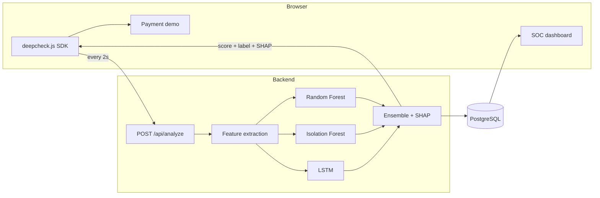

# DeepCheck

**Real-time behavioral bot detection for online payments.**

DeepCheck tells humans and bots apart by *how they behave* — mouse trajectories, typing rhythm, scroll patterns, hesitation — and returns an explainable 0–100 risk score while the user is still on the page. No CAPTCHAs, no puzzles, no friction for real customers.

Built for the **Teknofest Financial Technologies Competition**.

```
Genuine user  →  12.4  →  payment proceeds silently
Bot detected  →  94.1  →  session blocked, with the reasons attached
```

---

## The problem

Payment fraud is automated. Bots run card testing, credential stuffing and checkout abuse at a scale no manual review can match, and modern automation mimics human behavior well enough to walk past traditional defenses. The usual countermeasure — CAPTCHAs and static rule engines — punishes the wrong people: real customers get puzzles and drop out of the funnel, while the bots that matter solve them anyway.

## The approach

Behavior is expensive to fake convincingly and free to observe. DeepCheck watches *how* an interaction happens rather than *who* claims to be doing it, so verification costs a legitimate user exactly nothing — they never know it ran.

Three properties make it usable in a payment flow rather than just a lab:

- **Invisible.** One script tag. Nothing is shown to the user, nothing is asked of them.
- **Explainable.** Every score carries its SHAP feature attribution, so a fraud analyst — or a regulator — can see *why* a session was flagged instead of trusting a black box.
- **Privacy-preserving.** The SDK records keystroke *timing* only. Never key content, never field values, never card data. Nothing sensitive leaves the page.

---

## Architecture



The SDK keeps a 10-second rolling window of behavior and flushes every 2 seconds, so a couple of quiet seconds — a user typing without moving the mouse — doesn't blank out the signal.

---

## Quick start

```bash
docker-compose up --build
```

That's the whole thing. On first run the backend trains the models automatically (a few minutes — the model binaries are deliberately not committed, see [Model artifacts](#model-artifacts)).

> **Upgrading an existing checkout?** Run `docker-compose down -v` first. The
> schema gained columns (`evidence_state`, `reason_codes`, and the kinematics
> and cross-channel features), and SQLAlchemy's `create_all()` only creates
> tables it does not find — it never adds a column to a table that already
> exists. Against a stale `deepcheck-db-data` volume every query touching the
> new columns fails with *column does not exist*. Dropping the volume is fine
> here because the data is demo telemetry; a real deployment needs a migration
> (Alembic) instead.

| Surface | URL |
|---|---|
| Payment demo | http://localhost:3000/demo |
| SOC dashboard | http://localhost:3000/dashboard |
| API | http://localhost:8000 |

To train the models ahead of time and skip the wait on first boot:

```bash
cd backend && python train_model.py
```

---

## How the scoring works

Twelve behavioral features are extracted from each flush, every one normalized to roughly 0–1.

**Distribution-shape features** — cheap to compute, and cheap for an attacker to fake:

| Feature | What it measures |
|---|---|
| `scroll_hizi_varyansi` | Variance in scroll speed — humans accelerate and hesitate, scripts don't |
| `tereddut_skoru` | Average pause before acting; genuine hesitation before committing |
| `etkilesim_entropisi` | Regularity of event spacing, measured **per input channel** |
| `ivme_degisimi` | Variance of mouse *acceleration*, not just speed |
| `tiklama_yogunlugu` | Click density inside the most recent 5-second window |
| `odak_degisimi` | How often the tab lost focus |

**Kinematics and timing-structure features** — these exist because the six above are not enough. A script emitting `x += gauss(6, 6)` per step reproduces human-looking variance and entropy almost exactly, and such a replay scored **9.1/100 ("Gerçek Kullanıcı", confidence 0.91)** against this API. Independent per-step noise has human *marginals* but none of the structure real motor control produces:

| Feature | What it measures |
|---|---|
| `hiz_otokorelasyonu` | Does speed correlate with its own previous value? Real motion carries momentum; IID jitter gives ~0 |
| `yon_tutarliligi` | Direction persistence between consecutive moves. Target-directed motion keeps its heading; jitter re-rolls it every step; a linear script never turns at all |
| `zaman_kuantasyonu` | How often the *same* millisecond gap repeats — scripted timers do, hands don't |
| `duraklama_dagilimi` | Spread of inter-event gaps. Human pauses are heavy-tailed; fixed or uniform-random script delays are not |

**Cross-channel synchronization** — the two features above still measure structure *within* one channel, which an attacker can fake a channel at a time. These measure how a single person's channels relate to each other:

| Feature | What it measures |
|---|---|
| `tiklama_oncesi_hareket` | Do clicks have pointer motion before them? A person moves the cursor to a target; `element.click()` has nothing before it |
| `kanal_gecis_gecikmesi` | Time cost of moving a hand between keyboard and mouse. A script pays nothing |

Both are count/ratio statistics rather than distribution shapes, deliberately: they stay valid on thin flushes instead of re-creating the small-sample failure described below. A third candidate, channel *simultaneity*, was implemented, measured at 0.07 human vs 0.07 bot, and **removed** — a feature that separates nothing is noise, not signal.

Reproducing these requires modelling human motor control rather than adding noise. The same replay that scored 9.1 now scores **88.5 ("Bot Tespit Edildi")** in simulation, driven by `hiz_otokorelasyonu` and `duraklama_dagilimi` in the SHAP attribution.

### The simulator is not the benchmark

Synthetic separation is a self-assessment: the personas and the detector have the same author. The [adversarial bot lab](lab/README.md) drives a **real Chromium browser** through the real SDK, and its first run showed how far that can be from reality — the identical evasive attack scored **88.9 (blocked) in simulation and 36.5 (approved) through a real browser**, because two heavy timing features are inverted between the two distributions:

| feature | real bot | synthetic bot | what the model had learned |
|---|---|---|---|
| `etkilesim_entropisi` | 0.225 | 0.836 | high = bot → real bot read as human |
| `duraklama_dagilimi` | 1.000 | 0.264 | high = human → real bot read as human |

`lab/capture.py` records labelled real-browser telemetry, which is blended into training with session-level (per browser run) holdout splits — a random per-flush split would put the same session on both sides and inflate the result. Held-out real-browser accuracy is reported separately from synthetic accuracy by `train_model.py`.

**Every one of these features requires a minimum sample count before it counts as a measurement.** An autocorrelation over 4 points, or an entropy over 4 gaps (which saturates at exactly 1.0 whenever the few values it sees are distinct), is sampling noise. Treating thin estimates as evidence scored an ordinary 5-keystroke card-form session **89.2 — a blocked customer, not a bot**. Below the threshold a feature falls back to a neutral value instead, and the *policy* layer handles the resulting uncertainty (see `signal_sufficiency` below).

Interaction entropy is computed per channel and then combined, rather than by merging every timestamp into one stream first. Merging is the obvious implementation and it is wrong: interleaving several independently-regular channels produces a sequence that looks irregular even when each channel is perfectly robotic on its own — a beat-frequency artifact that measured ~0.92 entropy for three channels that individually scored 0.0.

Those ten features feed three models whose outputs are blended:

```
support           = temporal_support(flush)          # 0-1
lstm_weight       = 0.3 × support
rf_weight         = 0.5 + (0.3 − lstm_weight)        # LSTM's unearned share
fraud_probability = rf_weight × RF + 0.2 × IsolationForest + lstm_weight × LSTM
risk_score        = 100 × fraud_probability
```

The Isolation Forest is trained only on human behavior, so it flags anomalies rather than learning a bot signature — which matters for automation that doesn't resemble anything in the training set.

**Tried and rejected: training the LSTM on sparse sequences.** The obvious way to make the LSTM useful on thin flushes is to feed it more of them — truncating a fifth of simulated sessions to an early-flush view, which is realistic since a 2-second flush at session start genuinely *is* a truncated session. Measured on an identical evaluation set, it made things worse: LSTM accuracy on tiled input fell from 0.8603 to **0.7539**, and RandomForest accuracy fell from 0.9838 to 0.9524 — the RF being the component that actually decides sparse verdicts. Cross-seed stability barely moved. The reason is structural: a tiled sequence is a *constant* series carrying exactly the information already in the aggregate feature vector, so there the LSTM is not a temporal model at all but a weaker, higher-variance duplicate of the RF (0.75–0.86 against 0.90–0.92). Extra examples cannot teach it something the input does not contain. The damping below is therefore the measured better answer, not a workaround. `train_model.py --seed N` reproduces the experiment.

**The LSTM only votes when it has something to read.** When a flush is too sparse to slice into windows, `build_sequence()` falls back to tiling one snapshot across all timesteps — a *constant* series, from which the network's output is an arbitrary function of the feature vector rather than a reading of anything temporal. This was measured, not theorised: two runs of the identical training script (differing only in an unseeded RNG) gave LSTM outputs of 0.98 and 0.43 on the same headless-bot payload, and at a fixed 0.3 weight that arbitrary draw was worth 16 risk points — enough to flip the verdict across the blocking threshold. Scaling the weight by `temporal_support` and handing the remainder to the Random Forest takes that swing to **0.0 points** on tiled flushes while keeping the LSTM's full contribution on rich ones. The three weights always sum to 1.0.

A session's reported score is the **median of its last 5 flushes**, not the instantaneous value. One incidental pause in an otherwise robotic session shouldn't flip the verdict; an anomaly has to persist to move it. Smoothing only means anything because a session now has exactly one authenticated writer — when the session id came from the client, a flagged session could be walked back down from 86.7 to 50.6 just by flooding it with human-shaped payloads.

### Signal sufficiency

Each response also carries `signal_sufficiency` (0–1): how much real evidence the flush actually contained. A near-empty payload makes most features fall back to neutral, so it scores mid-scale *by construction* — which is honest for a score but must not read as "cleared". The server refuses to auto-approve a payment below `MIN_SIGNAL_FOR_AUTO_APPROVE` and steps it up instead. This is what stops a signal-starved headless script without inventing a confident accusation against a quiet human, whose feature vector is genuinely identical.

### Risk bands

| Score | Label | Action |
|---|---|---|
| 0–40 | Gerçek Kullanıcı | No intervention |
| 40–60 | Şüpheli | Warning shown |
| 60–80 | Yüksek Risk | Step-up verification |
| 80–100 | Bot Tespit Edildi | Session blocked |

---

## API

Every scoring call is authenticated. `POST /api/session` mints a session id and returns an HMAC-signed bearer token; the id is **never** accepted from the client, because that is what previously allowed anyone to write behaviour under someone else's session.

**`POST /api/analyze`** — submit a behavior window, get a score back. Requires `Authorization: Bearer <token>`.

```json
{
  "session_id": "kR7t2FpQ9wZ1xN4cB8vL6s",
  "risk_score": 73.4,
  "label": "Yüksek Risk",
  "confidence": 0.91,
  "shap_explanation": [
    { "feature": "hiz_otokorelasyonu", "value": 0.38, "impact": 22.1 },
    { "feature": "duraklama_dagilimi", "value": 0.21, "impact": 21.5 },
    { "feature": "ivme_degisimi",      "value": 0.63, "impact": 17.1 }
  ],
  "response_time_ms": 42.1,
  "signal_sufficiency": 1.0
}
```

| Endpoint | Auth | Purpose |
|---|---|---|
| `POST /api/session` | — | Mint a session id + signed token |
| `POST /api/analyze` | Bearer token | Score a behavior window |
| `POST /api/transaction` | Bearer token | **Server-side** allow / step-up / deny decision |
| `POST /api/transaction/verify` | Bearer token | Verify a step-up code (single-use, 5 attempts) |
| `POST /api/decision/verify` | — | Verify a signed decision artifact |
| `GET /api/score/{session_id}` | Operator key | Full history for one session |
| `GET /api/sessions` | Operator key | All sessions, for the dashboard |
| `GET /api/health` | — | Service and model status |

### Enforcement happens on the server

The risk score gates the payment in `POST /api/transaction`, not in the browser. The frontend's `riskScore >= 80` is presentation only — it changes what the page looks like, not what the server permits. This matters because blocking used to exist *solely* as a disabled button in React: an attacker simply didn't run the frontend, and the score was advisory.

| Server decision | Meaning |
|---|---|
| `onaylandi` | Approved |
| `dogrulama_gerekli` | Step-up challenge issued (also when signal is too thin to judge) |
| `reddedildi` | Blocked |

Every decision is returned as an **HMAC-signed artifact** carrying the decision, session, risk score, amount and policy version. A downstream payment backend verifies it via `POST /api/decision/verify` rather than trusting whatever the caller forwarded, so the enforcement boundary stays server-side even when the payment step lives in another service. Changing any signed field fails verification.

Each decision also carries **Turkish reason codes** and an **evidence state** (`Yeterli sinyal` / `Yetersiz sinyal` / `Anormal ama belirsiz` / `Yüksek güvenli otomasyon`). Reason direction comes from the SHAP *sign*, so an explanation can never contradict the model that produced the score, and "we could not observe enough" is stated explicitly rather than dressed up as an accusation.

### SDK usage

```html
<script src="/deepcheck.js"></script>
<script>
  DeepCheck.init({
    apiUrl: "http://localhost:8000",
    intervalMs: 2000,
    onUpdate: (result) => {
      // { risk_score, label, confidence, shap_explanation }
      gateCheckout(result.risk_score);
    },
  });
</script>
```

---

## Performance

Measured by `backend/benchmark.py` against the shipped models, 1500 scoring calls across all evaluation slices:

| Metric | Value |
|---|---|
| p50 | 14.5 ms |
| p95 | 16.6 ms |
| p99 | 18.8 ms |

This is **model scoring time** — feature extraction, all three models, and SHAP attribution. It excludes the database write and network transit, so it is not an end-to-end figure. Re-run `benchmark.py` on your own hardware before quoting a number.

---

## Testing

```bash
cd backend && pytest test_scorer.py test_security.py   # 44 regression tests
python benchmark.py                                    # accessibility slices + latency
python ../lab/bot_lab.py --api http://127.0.0.1:8000   # real-browser attack ladder
```

44 regression tests, each one a bug or an attack that actually happened and must not come back — a sparse typing session scored as high-risk, a bot that evaded detection by pausing once, a keyboard-injection session that scored as human, the IID-random-walk replay that scored 9.1, a forged session token, a poisoning attempt that keeps a valid signature and swaps the target id, a tampered decision artifact, and an under-sampled estimator inventing evidence. They assert *behavior* rather than exact values, so a change to a feature formula or the training distribution fails loudly instead of silently degrading detection.

`benchmark.py` reports false-positive rate **per interaction style** (keyboard-only, slow typist, low-pointer, sparse first flush, rapid legitimate user) with 95% Wilson confidence intervals and explicit sample sizes — because a global accuracy number hides exactly the failure that matters, and "FPR under 1%" from a handful of sessions is not a measurement. Current result: 0 blocked out of 250 in every legitimate slice, CI [0.00%, 1.51%].

`lab/bot_lab.py` is the held-out adversary. Detection numbers measured in the simulator do not survive contact with a real browser, and the lab is what makes that visible rather than assumed.

Training and inference share the same `extract_features()` code path: `train_model.py` simulates raw sessions and pushes them through the identical extraction used at serving time, so a change to a feature formula flows into the training data automatically and cannot drift apart.

---

## Project structure

```
deepcheck/
├── sdk/deepcheck.js          Browser SDK — behavioral collection
├── backend/
│   ├── main.py               FastAPI endpoints, server-side decisions
│   ├── security.py           Session tokens, rate limiting, signed decisions
│   ├── scorer.py             Feature extraction, ensemble, SHAP
│   ├── reasons.py            Turkish reason codes + evidence state
│   ├── lstm_model.py         PyTorch sequence model
│   ├── train_model.py        Synthetic + real-telemetry training
│   ├── benchmark.py          Accessibility slices, attack detection, latency
│   ├── test_scorer.py        Behavioral regression tests
│   ├── test_security.py      Auth, rate-limit and signing tests
│   └── models.py             SQLAlchemy schema
├── lab/
│   ├── bot_lab.py            Real-browser attack ladder (Playwright)
│   ├── capture.py            Records labelled real-browser telemetry
│   ├── harness.html          Minimal payment form loading the real SDK
│   └── real_telemetry.json   Captured dataset (used in training)
├── frontend/src/
│   ├── pages/Demo.jsx        Payment demo with live scoring
│   └── pages/Dashboard.jsx   SOC dashboard, D3 charts
└── docs/index.html           Product landing page (served by GitHub Pages)
```

**Stack:** FastAPI · PostgreSQL · scikit-learn · PyTorch · SHAP · React · Vite · Tailwind · D3

---

## Model artifacts

`model.pkl` and `lstm_model.pt` are **not committed**. They are regenerated by `train_model.py` (fixed seed, reproducible), `entrypoint.sh` builds them automatically if missing, and a ~10 MB binary in git history is permanent weight. Pickles are also version-fragile — they must be loaded by the same scikit-learn version that wrote them, so pinning the training environment matters more than shipping the file. See `backend/requirements.txt`.

Training generates 50,000 synthetic sessions across six personas — natural humans, rushed-but-genuine humans, sparse first-flush humans, naive scripts, human-mimicking bots, and `bot_evasive` (a transcription of an evasion that actually worked against this API) — with cross-contamination so the two classes are not trivially separable. Labelled **real-browser** telemetry from `lab/capture.py` is blended in on top, because the simulator alone teaches the wrong sign on the timing features.

---

## Project status

This is a **competition MVP**, and worth reading as one.

The detection pipeline, the SDK, and both interfaces work end to end and are what you see running. Current models are trained on synthetic behavior, so reported separation reflects the quality of that simulation rather than measured performance against real traffic — collecting labeled sessions from real users and off-the-shelf automation frameworks is the next substantive step, and no accuracy claim here should be taken as a production benchmark until then.

The deployment is sized for demonstration rather than production, and the security controls are honest about where that line falls. Session tokens, server-side enforcement, operator auth on the dashboard, rate limiting and the step-up challenge are all real and tested. But: the rate limiter and challenge store are in-process, so with multiple workers the effective limits multiply and a challenge issued by one worker cannot be verified by another — both need Redis or Postgres to be correct in production. The operator key ships in the frontend bundle, which makes it a deployment gate rather than per-user authentication; a real SOC dashboard needs an operator login.

Most importantly, **none of this makes client-submitted telemetry trustworthy.** Session tokens stop forgery and cross-session tampering; they cannot stop an attacker from lying about their own behaviour, because the browser is theirs. The kinematics features raise the cost of that lie from "add Gaussian noise" to "model human motor control", which is a real increase but not a proof. Treat the score as one input to a server-side decision alongside signals the client does not control — IP/ASN reputation, TLS fingerprint, velocity — never as the decision itself.

---

## Configuration

| Variable | Default | Purpose |
|---|---|---|
| `DEEPCHECK_SECRET` | *generated per process* | HMAC key for session tokens. **Must be set** for multi-worker or restart-stable deployments — otherwise each worker signs with a different key. |
| `DEEPCHECK_OPERATOR_KEY` | *generated per process* | Gates the dashboard read endpoints; must match the frontend's `VITE_OPERATOR_KEY`. |
| `DEEPCHECK_ALLOWED_ORIGINS` | `http://localhost:3000,http://127.0.0.1:3000` | CORS allowlist. Never `*`. |
| `DEEPCHECK_DEMO_MODE` | `1` | Returns the step-up code in the API response (no SMS provider in the MVP). Set `0` in production. |
| `DEEPCHECK_STORE_RAW_TELEMETRY` | `0` | Persist raw mouse/click/keystroke timing. Off by default: nothing reads it back, and it is behavioural biometric data. |

Both secrets fall back to a per-process random value with a loud warning, so `docker-compose up` works with no configuration — that fallback is explicitly not safe for a real deployment.

---

## Deployment

**Primary, tested path: Docker Compose + Uvicorn.**

```bash
docker-compose up --build
```

Runs `main.py` under Uvicorn via `backend/entrypoint.sh` and `backend/Dockerfile`. This is the configuration the demo and dashboard are verified against.

**Optional: AWS Lambda.**

`backend/lambda_handler.py` (Mangum adapter) and `backend/template.yaml` (AWS SAM) host the same FastAPI app behind API Gateway:

```bash
cd backend && sam build --use-container && sam deploy --guided
```

This path is **present as code but not deployed or tested** in this repository. A real Lambda deployment needs container-image packaging (torch + shap exceed the zip size limit) and a `DATABASE_URL` pointing at a reachable Postgres instance such as RDS or Aurora — there is no bundled database on Lambda.

---

## Contact

**Huseyn Huseynov** · [hhuseynov0707@gmail.com](mailto:hhuseynov0707@gmail.com) · Baku, Azerbaijan
