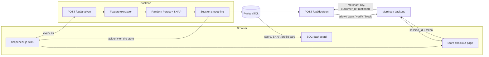

# DeepCheck

**Real-time behavioral bot detection for online payments.**

DeepCheck tells humans and bots apart by *how they behave* — mouse trajectories, typing rhythm, scroll patterns, hesitation — and returns an explainable 0–100 risk score while the user is still on the page. No CAPTCHAs, no puzzles, no friction for real customers.

Built for the **Teknofest Financial Technologies Competition**.

```
Genuine user  →  12.4  →  payment proceeds silently
Bot detected  →  94.1  →  server declines the charge; the SOC sees why
```

---

## The problem

Payment fraud is automated. Bots run card testing, credential stuffing and checkout abuse at a scale no manual review can match, and modern automation mimics human behavior well enough to walk past traditional defenses. The usual countermeasure — CAPTCHAs and static rule engines — punishes the wrong people: real customers get puzzles and drop out of the funnel, while the bots that matter solve them anyway.

## The approach

Behavior is expensive to fake convincingly and free to observe. DeepCheck watches *how* an interaction happens rather than *who* claims to be doing it, so verification costs a legitimate user exactly nothing — they never know it ran.

Three properties make it usable in a payment flow rather than just a lab:

- **Invisible.** One script tag. Nothing is shown to the user, nothing is asked of them.
- **Explainable.** Every score carries its SHAP feature attribution, so a fraud analyst — or a regulator — can see *why* a session was flagged instead of trusting a black box. It is stored on the row and shown in the SOC dashboard, and deliberately **not** returned to the party being scored: naming the three features that convicted a caller is a tuning signal.
- **Privacy-preserving.** The SDK records keystroke *timing* only. Never key content, never field values, never card data. Nothing sensitive leaves the page.

---

## Architecture


```mermaid
flowchart LR
    subgraph Browser
        A[deepcheck.js SDK]
        I[Store checkout page]
        J[SOC dashboard]
    end

    subgraph Backend
        B[POST /api/analyze]
        C[Feature extraction]
        D[Random Forest + SHAP]
        G[Session smoothing]
    end

    H[(PostgreSQL)]

    M[Merchant backend]

    A -->|every 2s| B
    B --> C
    C --> D
    D --> G
    G --> H
    G -->|"ack only on the store"| A
    A --> I
    H -->|score, SHAP, profile card| J
    I -->|session_id + token| M
    M -->|"+ merchant key, customer_ref (optional)"| K[POST /api/decision]
    H --> K
    K -->|allow / warn / verify / block| M
    M --> I
```

On the store the payer's browser sees no score at all: the store's nginx adds `X-DeepCheck-Reply: ack` to the SDK's calls, so the core answers each behaviour window with `{session_id, accepted}` only. Callers that reach the core directly without that header (the lab tools) still get the full reply. The decision that gates a payment is made by `POST /api/decision` on the server, from the score stored in Postgres — a control in the browser is a control the attacker can edit.

**What this evidence is worth.** Telemetry is submitted by the client, and the session token only proves the sender holds a token for that session — never that a human produced the behaviour. Against an adversarial harness written from motor-control first principles rather than from this project's own personas, the served model blocked straight-line automation 100% of the time and approved an independently written humanised bot 100% of the time (12 sessions per class, [docs/evaluation.md](docs/evaluation.md)). So behavioural risk belongs alongside device, network and card-level signals as one input to a decision, not as the sole gate on a payment. The demo gates on it alone because a demo has nothing else to gate on.

The SDK keeps a 10-second rolling window of behavior and flushes every 2 seconds, so a couple of quiet seconds — a user typing without moving the mouse — doesn't blank out the signal.

---

## Quick start

```bash
docker-compose up --build
```

That's the whole thing. On first run the backend trains the models automatically (4–8 minutes, and it says so on the console — the model binaries are deliberately not committed, see [Model artifacts](#model-artifacts)).

| Surface | URL |
|---|---|
| Store checkout (TechStore / DemoPay; shows no score) | http://localhost:3000 |
| SOC dashboard (log in with `DASHBOARD_KEY`; loopback only) | http://localhost:3100 |
| Core API (loopback only) | http://localhost:8000 |

The store and the SOC are separate apps, each with its own server
(`apps/`, design in [docs/architecture-two-apps.md](docs/architecture-two-apps.md)).
The store needs `CHECKOUT_MERCHANT_ID` / `CHECKOUT_MERCHANT_KEY` /
`CHECKOUT_CUSTOMER_REF_KEY`, the SOC needs `DASHBOARD_KEY` and
`SOC_SESSION_SECRET` (see `.env.example`). The two-laptop jury flow is in
[docs/canli-demo.md](docs/canli-demo.md).

The store is a guest checkout: it asks for no e-mail address or account, and
the browser sends the store's server only the session id, the SDK token and the
card's display fields (last 4, brand, expiry). The store's server names each
checkout by a per-session pseudonymous reference,
`"misafir-" + HMAC-SHA256(CHECKOUT_CUSTOMER_REF_KEY, "session:" + session_id)[:24]`,
so the core can record the decision for the SOC; no two checkouts share it.

The legacy single-page demo that used to run beside them on port 3200
(`frontend/`, with its live score badge and the synthetic-customer selector)
was deleted on 2026-10-02, together with `docker-compose.dev.yml`.
`docker compose` now runs six services: db, backend, checkout-api,
checkout-web, soc-api, soc-web.

To train the models ahead of time and skip the wait on first boot:

```bash
cd backend && python train_model.py
```

### Jury demo: synthetic customers

The per-customer profile layer can only compare a customer with their own history once it holds 19 of their sessions in one input type, and the team has no customer base. The jury prototype therefore uses **synthetic demo customers**: Ayşe, Mehmet and Zeynep are simulator identities (`train_model.simulate_identity_sessions`), each seeded with 20 mouse and 20 keyboard sessions in the reserved `demo` merchant namespace. They are not people, and every place that shows them says so. The data is flagged `is_synthetic`, the customer references read `sentetik-…`, and `demo_seed.py` prints every simulated session under a "SİMÜLE EDİLMİŞ OTURUM" banner. The SOC panel badges simulated sessions and decisions made against a synthetic profile "Sentetik demo verisi". It reads the flag from `GET /api/score` and `GET /api/sessions`, and where the server does not send it the badge is absent rather than wrong. The metric cards leave simulated sessions out. No evaluation script reads them.

Add to `.env` (the full reasoning is in `.env.example`, section *Jury prototype*):

```
DEEPCHECK_PROFILE_KEY=<python -c "import secrets; print(secrets.token_urlsafe(32))">
DEEPCHECK_MERCHANT_KEYS=ornek-satici:<a second, different token>
PROFILE_LAYER=1
PROFILE_ESCALATION=1
DEMO_ENDPOINTS=1
```

```bash
docker compose up -d --build
docker compose exec backend python demo_seed.py              # seed; idempotent, about 20 s
docker compose exec backend python demo_seed.py --status     # budgets and state
docker compose exec backend python demo_seed.py --reset      # delete and seed again
docker compose exec backend python demo_seed.py --simulate ayse   # contrast case
```

There is no page for them any more: the only page that let a person pay *as* a synthetic customer was the legacy demo, deleted on 2026-10-02, and the store never names one (each checkout gets its own guest reference). The act runs from the CLI: `--simulate` sends a new session of the *same* synthetic identity through the core's real HTTP path (`/api/session`, attestation, `/api/analyze`, then `/api/demo/charge` in the `demo` namespace), prints the decision, and the SOC shows the session labelled "Sentetik demo verisi". It is expected not to be challenged. The opposite case — a real person deviating from a synthetic history and being asked for the code — has no path in the current stack; the record below is from the deleted page.

Verified end to end on 2026-09-19 in an isolated Docker stack (DEBUG=0, enforcing, the served model), on the since-deleted demo page. A Playwright session scripted with the lab's human motion model (`lab/bot_lab.py`, not a person) paid as Ayşe and as Mehmet. Both scored in the green band (29.5 and 23.0) and both were stepped up by the profile layer (`profile_deviation`, p = 1/21, 20 references), and the code then let the payment through. `--simulate` for Ayşe and Mehmet (mouse) was charged without a challenge (p 0.67 and 0.81). **That demonstrates the mechanism, not accuracy on real people.** A real person differs from every simulator identity by construction. The only same-person figure is the synthetic one in [docs/profile-evaluation.md](docs/profile-evaluation.md): 4.9% challenged, a lower bound. `--simulate` draws a mouse session unless given `--modality keyboard`. For fresh sessions of the same identity, a keyboard-only session was compared in 30, 20 and 0 of 30 tries for Ayşe, Mehmet and Zeynep. A keyboard session measures only 6–7 of the 12 features, and below that the layer abstains rather than guess. Touch has no synthetic history at all. The step-by-step procedure (Turkish) is in [docs/juri-cevaplari.md](docs/juri-cevaplari.md#demo-prosedürü--sentetik-demo-müşterileri).

---

## How the scoring works

Twelve behavioral features are extracted from each flush, every one normalized to roughly 0–1.

The first six are **marginal statistics** — variances, entropies, means:

| Feature | What it measures |
|---|---|
| `scroll_hizi_varyansi` | Variance in scroll speed — humans accelerate and hesitate, scripts don't |
| `tereddut_skoru` | Average pause before acting; genuine hesitation before committing |
| `etkilesim_entropisi` | Regularity of event spacing, measured **per input channel** |
| `ivme_degisimi` | Variance of mouse *acceleration*, not just speed |
| `tiklama_yogunlugu` | Click density inside the most recent 5-second window |
| `odak_degisimi` | How often the tab lost focus |

An attacker reproduces marginal statistics with independent per-step noise, and noise is free: measured here, a straight-line bot with two pixels of jitter halved its risk score and was approved. The other six measure **structure** that independent noise does not have, which takes modelling human motor control rather than adding noise:

| Feature | What it measures |
|---|---|
| `hiz_otokorelasyonu` | Lag-1 autocorrelation of pointer speed — real motion carries momentum; IID jitter has ~none |
| `yon_tutarliligi` | Mean cosine between consecutive move vectors — real motion is target-directed |
| `zaman_kuantasyonu` | How often an inter-event gap repeats the *same millisecond*; scripted timers do, hands do not |
| `duraklama_dagilimi` | Coefficient of variation of gaps — human pauses are heavy-tailed, a fixed delay is not |
| `tiklama_oncesi_hareket` | Share of clicks preceded by pointer motion — a synthetic click teleports |
| `kanal_gecis_gecikmesi` | Median delay when input switches between pointer and keyboard — a hand has to move |

The structural six are a **designed** mitigation, not a measured one: they were written against this project's own adversary, and the lab's "human" rows are scripted. And four of the twelve saturate on real browser telemetry — `scroll_hizi_varyansi` was never measured once in 234 captured lab rows, `ivme_degisimi` sits at exactly 1.0 in 90 of them. `TECHNICAL_GUIDE.md` §20 has the counts and the re-capture plan.

Interaction entropy is computed per channel and then combined, rather than by merging every timestamp into one stream first. Merging is the obvious implementation and it is wrong: interleaving several independently-regular channels produces a sequence that looks irregular even when each channel is perfectly robotic on its own — a beat-frequency artifact that measured ~0.92 entropy for three channels that individually scored 0.0.

Those features feed one model:

```
vote_share = RandomForest.predict_proba(features)[fraud]
risk_score = 100 × vote_share
```

`vote_share` is the forest's vote share, **not** a calibrated `P(fraud | behaviour)`. Nothing has calibrated it against a base rate, because there is no labelled real traffic to calibrate against. `confidence` in the API response is the same number.

It used to be a blend, `0.6 × RandomForest + 0.4 × LSTM`, and the LSTM was **removed on measurement** too. `backend/model_selection.py` reproduces the study. The LSTM was trained on simulated sessions only, and on browser traffic its output collapsed toward "human": bots scoring ≥60 fell from 0.90 (forest alone) to 0.79 in the blend. In the mid-session handover it existed for, it reacted four flushes *later* than the forest reading the current flush. Gradient boosting was measured too and not adopted. It caught more of the attack scenarios it had seen, but with a human scenario held out of training, LightGBM blocked 74% of those unseen humans; the forest blocked none. The honest cost is in the study: the LSTM also damped legitimate scores, so more typical users now reach step-up verification instead of an immediate approval.

There used to be a third at 0.2, an Isolation Forest, and it was **removed on measurement rather than on taste**. It is fitted on human rows only, so “normal” to it means the human distribution — and the automation this product exists to stop is automation that has been made to look human. On held-out real browser rows its standalone discrimination came out at ROC-AUC **0.340**: not weak, inverted. It was voting for the attacker. Replaying identical telemetry through both weightings, dropping it moved the mean human score from 19.0 to 9.3 and mean `bot_linear` from 86.0 to 92.4 — it had been adding much the same offset to everyone, inflating scores without separating them. It also cost 14 ms of the 32 ms a flush took to score.

It is still trained and still stored in the bundle, so the decision can be re-measured once there are real human recordings to measure against. Nothing reads it per request.

A session's reported score is the **median of its last 5 flushes**, not the instantaneous value. One incidental pause in an otherwise robotic session shouldn't flip the verdict; an anomaly has to persist to move it. The exception is a jump of 35 points or more above the recent median: that is a handover, not noise, and smoothing may not hide it (`scorer.smooth_session_score`).

### Risk bands

| Score | Label | Action |
|---|---|---|
| 0–40 | Gerçek Kullanıcı | No intervention |
| 40–60 | Şüpheli | Warning shown |
| 60–80 | Yüksek Risk | Step-up verification |
| 80–100 | Bot Tespit Edildi | Session blocked |

---

## API

**`POST /api/analyze`** — submit a behavior window, get a score back.

```json
{
  "session_id": "8f14e45f-ceea-467a-9f8c-2b1c3d4e5f6a",
  "risk_score": 73.4,
  "label": "Yüksek Risk",
  "confidence": 0.91,
  "shap_explanation": [
    { "feature": "etkilesim_entropisi", "value": 0.12, "impact": 28.3 },
    { "feature": "tereddut_skoru",      "value": 0.00, "impact": 24.1 },
    { "feature": "ivme_degisimi",       "value": 0.98, "impact": 19.7 }
  ],
  "response_time_ms": 42.1
}
```

| Endpoint | Auth | Purpose |
|---|---|---|
| `POST /api/session` | — | Open a session: returns a signed proof-of-work challenge, no token |
| `POST /api/session/attest` | — | Exchange a solved challenge plus runtime measurements for the token |
| `POST /api/analyze` | `X-DeepCheck-Token` | Score a behavior window. With `X-DeepCheck-Reply: ack` (set by the store's nginx) the reply is `{session_id, accepted}` only |
| `POST /api/decision` | `X-DeepCheck-Token` | **The enforcement point.** Returns the action to take and why |
| `POST /api/demo/charge` | `X-DeepCheck-Token` | Demo merchant backend: applies the decision and charges, or declines. Used by `demo_seed.py --simulate` and the lab tools; the store's page cannot reach it |
| `POST /api/demo/verify` | `X-DeepCheck-Token` | Demo step-up: records a successful verification on the server |
| `GET /api/score/{session_id}` | `X-Dashboard-Key` | Full history for one session |
| `GET /api/sessions` | `X-Dashboard-Key` | All sessions, for the dashboard |
| `GET /api/health` | — | Service and model status |

Four more exist only for the per-customer profile layer, which is **off by
default**; with it off they all answer 503. Each needs a merchant credential
(`X-Merchant-Id` + `X-Merchant-Key`), and `POST /api/decision` accepts an
optional `customer_ref` with the same headers:

| Endpoint | Auth | Purpose |
|---|---|---|
| `POST /api/profile/consent` | merchant | The **only** way a profile is created. Records the lawful basis; 409 if the customer objected |
| `POST /api/profile/erase` | merchant | `mode: erase` deletes everything; `mode: object` also leaves a tombstone. Always 204, so it is not an existence oracle |
| `POST /api/outcome` | merchant | Mark a session `settled` or `disputed`; a dispute deletes that session's stored vector |
| `GET /api/profile/review/{session_id}` | `X-Review-Operator` + `X-Review-Key` | Human review of a contested decision, per operator, with an access-audit row |

A raw `customer_ref` travels only inside a POST body — never a path, never a
query string, never a log — and is turned into an HMAC pseudonym immediately.
`TECHNICAL_GUIDE.md` §18 is the whole chain; §19 is what the layer does.

Session ids are minted server-side and signed with HMAC-SHA256 over
`DEEPCHECK_SECRET`. A client can hold a token but cannot mint one, so
telemetry cannot be posted under a session id its sender was not given. The
SOC endpoints expose every customer's live session and are behind a separate
key.

**Replay protection.** `/api/analyze` rejects (422) a flush whose newest event
is more than 15 s from the server clock, a flush whose time runs backwards
within its session, and any telemetry whose clock-independent fingerprint
(timestamps rebased before hashing) has been seen before in *any* session. A
recording of a real person cannot be replayed under a fresh token, with or
without its timestamps rewritten.

**Evidence before a verdict.** `/api/decision` uses a stopping rule in the
shape of Wald's sequential probability ratio test, not a flush counter. It adds
up per-flush log-odds and stops once the sum crosses a bound. The scores are
uncalibrated forest vote shares from overlapping 10 s windows, so the bounds
are an operating point measured on synthetic data, not Wald's error rates. A
blatant session is decided at the three-flush floor, and an ambiguous one keeps
collecting instead of being waved through when a counter is satisfied. Between
the bounds the answer is step-up, and crossing the bot bound gives at least
step-up, whatever the smoothed score says. It also answers `verify`
while the session's last flush is older than 30 s.

One consequence worth naming: a mid-band score (40-60, "Şüpheli") never
charges the card, however long the session runs. That evidence supports
neither verdict, and ambiguity at a payment gate is a reason to ask for more
proof rather than to accept. A minimum of three analysed flushes still sits
underneath the sequential test, because a single fabricated window is the
cheapest thing an attacker can produce.

All published ports bind to loopback. `DEBUG` defaults to `1` so the stack
runs with no configuration, and that means the published development secrets
are in force — a session token anyone can forge and a dashboard key anyone can
read. Those defaults are only safe together while the ports are unreachable
from the network. Exposing the stack means setting `DEBUG=0` with real secrets
and `DEMO_ENDPOINTS=0` first.

**Conformal guard.** A one-directional safety net. If a score is unremarkable
among held-out real human sessions, the system refuses to block on it and asks
for verification instead. It can only soften a decision, never harden one, so
a mistake costs a challenge rather than a customer. Distribution-free and
independent of the model; its strength is the diversity of the calibration
sample. **As served it softens no block:** the bundles hold 36 calibration
values from the lab's scripted Playwright personas (no real human sessions),
the highest 27.71, so every score of 80 or more gets p = 1/37 = 0.027 < 0.05.
The model bundle logs this state at load. One plausible window is cheap to fabricate; six
seconds of sustained behaviour is not, and a verdict must be about behaviour
that is happening now.

**Runtime attestation.** `POST /api/session` returns a signed challenge and no
token. The token that `/api/analyze` requires comes only from
`POST /api/session/attest`, in exchange for a solved proof of work and two
runtime measurements: the clamp on `performance.now()` and the median delay of
`setTimeout(..., 0)`. Both values are self-reported. What the two checks
establish is that some client did the proof of work for this session inside
the challenge window and reported values inside browser-plausible bounds --
not that it is a browser, ran the SDK, or has a person behind it. A script
that reads the SDK passes: a plain Python client obtained a token 50 times out
of 50 (`backend/main.py`, the runtime-attestation comment).

Measured, because the number matters more than the idea: a 12-bit proof costs
Chromium about **75 ms over 7,600 hashes**, and costs a Python script about
**2 ms over 1,500 hashes**. That asymmetry runs the wrong way — JavaScript
SHA-256 is roughly thirty times slower than native, so raising the difficulty
taxes real customers harder than attackers. This is therefore **evidence that
code executed, not a cost barrier**, and the difficulty is set low enough that
the user cost stays small. The runtime values are also trivially forged once
you know the accepted ranges, which are in the source.

What it does close: posting telemetry without ever executing the SDK, which is
exactly how this project's own adversarial harness worked. What it does not
close: a bot driving a real browser, which produces a real proof and real timer
values.

Chromium reports its clock clamp as exactly 100.0 µs, which is the documented
value and a good sign the measurement reflects the engine.

**Rate limits.** Per IP for minting (10/min) and per session for scoring
(60/min) and checkout (20/min), returning 429 with `Retry-After`. Scoring is
keyed by session rather than by address on purpose: a demo stand or an office
puts many genuine users behind one IP. Two more exist for the profile layer:
profiled decisions per **customer** (60/h), which never refuses the checkout —
it stops the profile being read and asks for step-up instead — and profile
admin calls per merchant (600/min). Counters live in each worker's memory, so
the effective ceiling is up to `UVICORN_WORKERS` x these numbers; a shared
backend is the upgrade path for more than one host.

**Retention.** Raw telemetry is blanked after an hour and whole rows deleted
after a day, by a sweep that runs every 10 minutes under a **transaction-scoped**
Postgres advisory lock so only one worker does the work. The twelve features and
the score survive the first stage, so the dashboard history keeps working. A
second, independent sweep in its own transaction handles the profile layer:
idle profiles at 180 days, decision-audit rows at 90 and access-audit rows at
365. Neither sweep's failure can roll back or stop the other.

### SDK usage

```html
<script src="/deepcheck.js"></script>
<script>
  DeepCheck.init({
    apiUrl: "http://localhost:8000",
    intervalMs: 2000,
    onUpdate: (result) => {
      // { risk_score, label, confidence, shap_explanation }
      // Display only. Never gate a payment on this value — see Entegrasyon.
      showRiskBadge(result.risk_score);
    },
  });
</script>
```

`DeepCheck.getSessionId()` and `DeepCheck.getToken()` return what the checkout
call needs; `DeepCheck.ready()` resolves once the server has minted the
session.

`DeepCheck.flush()` sends the current window immediately and resolves when that
send finishes. It **never rejects**, so it is safe to `await` on the checkout
path — call it before asking for a decision, so the decision is made on the
behaviour that just happened rather than on a window up to two seconds old.

Three behaviours worth knowing before you integrate:

- **Each flush carries `client_sent_at`**, the sender's own clock. The server
  checks how old the events are on *that* clock, plus the stability of the
  session's clock offset, instead of comparing an absolute clock — so a
  customer whose machine is ten minutes off is not rejected.
- **On a 401 the SDK registers a new session once** and resends, so
  `getSessionId()` and `getToken()` can change during the life of a page. Read
  them when you need them; do not cache them at load.
- **There is no back-off on 429 or 503.** Any non-2xx raises into `onError` and
  a `deepcheck:error` DOM event, and a failed request never reaches `onUpdate`
  — a dead backend cannot look like a clean score. A back-off is designed in
  `TECHNICAL_GUIDE.md` §17.7 and is not implemented.

---

## Entegrasyon

Bir bankanın veya e-ticaret sitesinin DeepCheck'i devreye alması üç adımdır.

**1. SDK'yı sayfaya ekleyin.**

```html
<script src="https://<host>/deepcheck.js"></script>
```

**2. Oturumu başlatın.** Oturum kimliği ve imzalı jeton sunucudan gelir;
SDK bunu kendisi ister ve her akışta `X-DeepCheck-Token` başlığıyla gönderir.

```html
<script>
  DeepCheck.init({ apiUrl: "https://<host>" });
</script>
```

**3. Ödeme anında kararı SUNUCUNUZDAN alın ve uygulayın.** Tarayıcı, ödeme
isteğiyle birlikte `DeepCheck.getSessionId()` ve `DeepCheck.getToken()`
değerlerini kendi arka ucunuza gönderir; kararı arka ucunuz ister ve ödeme
sağlayıcısını yalnızca `allow` veya `warn` geldiğinde çağırır. Risk skorunu
tarayıcıda karşılaştırmayın ve ödemeyi tarayıcıdan başlatmayın: tarayıcıdaki
her kontrol saldırganın düzenleyebileceği bir kontroldür. Bu depodaki TechStore
mağazası bu deseni gösterir: sayfa (`apps/checkout`) mağaza sunucusuna
(`apps/checkout-server`) yalnızca oturum kimliğini, jetonu ve kartın görünen
alanlarını gönderir; kararı mağaza sunucusu satıcı anahtarıyla
`POST /api/decision`'a sorar, sayfada hiçbir koşul yoktur.

```js
// Merchant backend (Node örneği) — tarayıcıdan gelen session_id ve token ile
const res = await fetch("https://<host>/api/decision", {
  method: "POST",
  headers: {
    "Content-Type": "application/json",
    "X-DeepCheck-Token": token,
  },
  body: JSON.stringify({ session_id }),
});
const decision = await res.json();
if (decision.action === "allow" || decision.action === "warn") {
  await paymentProvider.charge(order);
}
```

```json
{
  "action": "verify",
  "risk_score": 73.4,
  "label": "Yüksek Risk",
  "message": "Ek dogrulama gerekli",
  "reason": "score"
}
```

`reason` kararın nedenini söyler: `score` (eşik), `insufficient_evidence`
(henüz 3 akıştan az davranış var — kullanıcıya "birkaç saniye sonra tekrar
deneyin" gösterin, OTP istemeyin), `stale` (son akış 30 saniyeden eski),
`unknown_session`, `verified` (ek doğrulama sunucuda kaydedilmiş ve `verify`
kararını `allow`a yükseltmiş).

**Ek doğrulama** sonucu tarayıcıda değil sunucuda tutulur: demo'daki
`POST /api/demo/verify` kodu doğrular ve oturuma yazar, sonraki karar çağrısı
bunu okur. Gerçek entegrasyonda bu adım SMS / 3-D Secure
sağlayıcınızdır. Doğrulama yalnızca `verify` kararını yükseltir; `block`
kararı hiçbir kodla aşılamaz.

| `action` | Skor | Etiket | Yapılması gereken |
|---|---|---|---|
| `allow` | 0–40 | Gerçek Kullanıcı | Ödemeyi işleyin, kullanıcı hiçbir şey görmez |
| `warn` | 40–60 | Şüpheli | Ödemeyi işleyin, uyarı gösterin |
| `verify` | 60–80 | Yüksek Risk | Ek doğrulama isteyin (SMS, 3-D Secure) |
| `block` | 80–100 | Bot Tespit Edildi | Ödemeyi reddedin |

Karar alınamazsa (ağ hatası, kayıtsız oturum, hiç telemetri göndermemiş bir
istemci) yanıt `verify` olur — asla `allow`. Skorun yokluğu masumiyet kanıtı
değildir; SDK'yı hiç çalıştırmayan bir istemcinin durumu tam olarak budur.

---

## Evaluation

Measured against **real Chromium telemetry**, not the simulator: 0% false positives on both legitimate scenarios (including keyboard-only), 76.1% bot recall on held-out browser runs. Both legitimate scenarios are *scripted* humans driven through a real browser, so that 0% means "does not flag this lab's model of a user" and not "does not flag customers". The honest caveat is in [docs/evaluation.md](docs/evaluation.md) — the detector catches attack techniques it has samples of and does not generalise to techniques it has not seen, which an independently written adversarial harness demonstrates directly.

`lab/` drives a real browser through the real SDK and records labelled telemetry; `backend/train_model.py` blends it into training with a run-level holdout.

**The first movement on mimicry.** Until 2026-09-07 the container served a model trained on synthetic data only — it resolves the telemetry path to the parent of `/app`, and `lab/` was not mounted into it, so training silently fell back. Every adversarial figure published before that date described the host model rather than the deployed one. With that fixed and the model actually trained on real browser rows, an independently written humanised bot moved from AUC 0.56 to **0.92** against humans: a randomly chosen bot session now scores higher than a randomly chosen human session 92% of the time, where before it was a coin flip.

It is still approved, because 22.7 sits far below the 40 where anything happens. The signal exists; the ladder is not placed to act on it. Moving the thresholds against an in-house adversary would fit the product to the attacker rather than to real users, so that calibration waits for recorded human sessions.

**Recording those sessions** is the open item, and the path works end to end:

```bash
cd backend
python record_session.py --list
python record_session.py --label human --to-training <session-id>
python train_model.py
```

`--to-training` is the part that matters: without it a recording lands where only `evaluate.py` reads it and never reaches the model. See [data/real/README.md](data/real/README.md) for what to collect — variety of input device matters more than volume.

**And a defect in the data itself.** In those 234 captured rows,
`scroll_hizi_varyansi` was never measured once — all 234 sit at its neutral
fallback, because no scenario scrolls — and `ivme_degisimi` reads exactly 1.0
in 90 of them, including *every* `H1_human` row and *every* `A3_human_mimic`
row. Between the lab's model of a person and the lab's best mimic, that feature
carries one bit, and it is the same bit. The percentile endpoints were fitted on
the simulator's distribution and real Chromium motion sits above the top of the
range. The fix is already half built — `lab/capture.py` now records raw
telemetry and `train_model` blends real raw values into the percentile pool —
but the existing file predates it and carries no raw, so retraining today
changes nothing. Re-capturing and retraining is the next step and has not been
done: [`TECHNICAL_GUIDE.md` §20](TECHNICAL_GUIDE.md#20-saturation-of-real-browser-features-and-the-re-capture-plan).

---

## Performance

**Scoring one flush** (`compute_risk`: feature extraction, the Random Forest and SHAP attribution) measured **17.7 ms** after the Isolation Forest left the score; it was 31.7 ms with it (`backend/scorer.py`). An older table here gave 42.4 ms: that was the three-model ensemble (Random Forest, Isolation Forest and LSTM), which no longer exists. This excludes the database write and network transit, so it is not an end-to-end figure.

**The checkout decision** (`POST /api/decision`) is measured end to end in the application, against a throwaway Postgres 16 with synthetic sessions, with the per-customer profile layer off, in shadow and enforcing: `docs/profile-evaluation.md` §11. Inside the docker-compose topology every configuration is within the 50 ms budget at p95; through Docker Desktop's port mapping on the Windows development host several are not.

**Capacity, storage and overload** are worked through on paper in [`TECHNICAL_GUIDE.md` §17](TECHNICAL_GUIDE.md#17-capacity-cost-and-overload--on-paper), from the per-request and per-row measurements that do exist: about **87 concurrent checkout sessions per vCPU** at saturation, **0.71 CPU-seconds per checkout**, **183 kB of storage per checkout** in the first hour falling to nothing after a day, and **32.7 kB** for a customer's whole behavioural profile. Row sizes there were measured on Postgres 16; the throughput figures are arithmetic from them, checked against the one real concurrency run in `AUDIT.md` to within 2.4 %.

**No load test has been run.** These are single-request latencies and per-row sizes, not a capacity measurement. Past the ceiling, requests queue and latency rises rather than being dropped, and every failure path resolves to `verify` — a saturated DeepCheck asks everyone for a second factor instead of letting fraud through. §17.6 lists what is still unbounded and §17.7 is the load-shedding design that does not exist yet. Measure your own deployment before quoting a number.

---

## Testing

```bash
cd backend && DEEPCHECK_SECRET=... DASHBOARD_KEY=... DEBUG=0 python -m pytest -q
cd apps/checkout-server && python -m pytest -q
cd apps/soc-server && python -m pytest -q
cd apps/checkout && npm test && npm run build
cd apps/soc && npm test && npm run build
python -m pytest -q lab/test_live_bot.py
```

**201 backend tests** (71 scoring and API, 100 profile layer, 17 synthetic demo, 13 for the store's score-free analyze reply), all passing as of 2026-10-02; the two app servers, the two app frontends and the stage bot have suites of their own (per-suite counts in `CLAUDE.md`), and the legacy demo's frontend suite was deleted with it on 2026-10-02. Most backend tests are a bug that actually happened and must not come back — a sparse typing session scored as high-risk, a bot that evaded detection by pausing once, a keyboard-injection session that scored as human, a checkout approved because the score never arrived, a step-up that could be turned into an approval by pressing pay again. They assert *behavior* rather than exact values, so a change to a feature formula or the training distribution fails loudly instead of silently degrading detection.

The profile layer's central property is asserted directly rather than argued: one test sweeps 1,320 combinations over HTTP and checks that the layer never blocks and never moves the score or the label.

The API tests run against a stub database rather than Postgres, deliberately: an authorization check that needs infrastructure to test is an authorization check that stops being tested.

Training and inference share the same `extract_features()` code path: `train_model.py` simulates raw sessions and pushes them through the identical extraction used at serving time, so a change to a feature formula flows into the training data automatically and cannot drift apart.

Measuring against real people is a separate question, and an open one — see [docs/evaluation.md](docs/evaluation.md).

---

## Project structure

```
deepcheck/
├── sdk/deepcheck.js          Browser SDK — behavioral collection (34 KB, no deps)
├── backend/
│   ├── main.py               FastAPI endpoints, decision path, retention sweeps
│   ├── scorer.py             Feature extraction, scoring, smoothing, SHAP
│   ├── lstm_model.py         FEATURE_NAMES, FEATURE_SCHEMA_VERSION, unserved LSTM
│   ├── profiles.py           Per-customer profile statistic (pure, no I/O)
│   ├── profile_lab.py        Measures that layer → docs/profile-evaluation.md
│   ├── model_selection.py    Model-family and temporal-model study
│   ├── train_model.py        Synthetic data generation + training
│   ├── demo_seed.py          Synthetic demo customers for the jury prototype
│   ├── benchmark.py          Form-fill generator, latency and score benchmarks
│   ├── record_session.py     Record a labelled real session to data/real/
│   ├── evaluate.py           Score those recordings → docs/evaluation.md
│   ├── test_scorer.py        71 tests — scoring, auth, enforcement, tokens
│   ├── test_profiles.py      100 tests — the profile layer end to end
│   ├── test_demo.py          17 tests — synthetic demo labelling
│   ├── test_analyze_ack.py   13 tests — the store's score-free analyze reply
│   └── models.py             SQLAlchemy schema (+ 4 profile tables)
├── apps/
│   ├── checkout/             TechStore guest checkout (React); shows no score;
│   │                         /gizlilik renders docs/kvkk-aydinlatma.md
│   ├── checkout-server/      Store server (FastAPI): asks /api/decision with the merchant key
│   ├── soc/                  SOC dashboard (React): D3 chart, SHAP bars, profile card
│   └── soc-server/           SOC backend-for-frontend (FastAPI): holds DASHBOARD_KEY
├── lab/                      Playwright capture, adversarial harness, stage bot (live_bot.py)
├── data/real/                Recordings of real people — currently EMPTY
└── docs/
    ├── evaluation.md         Browser-lab measurements
    ├── profile-evaluation.md Profile layer, generated by profile_lab.py
    ├── juri-cevaplari.md     Turkish answers for the jury
    ├── kvkk-aydinlatma.md    Privacy notice · dpia.md · rapor-duzeltmeleri.md
    └── index.html            Product landing page (served by GitHub Pages)
```

**Stack:** FastAPI · PostgreSQL · scikit-learn · PyTorch · SHAP · React · Vite · Tailwind · D3

---

## Model artifacts

The artifacts are **not committed**: they are regenerated by `train_model.py`, `entrypoint.sh` builds them automatically when they are missing or unusable, and a ~10 MB binary in git history is permanent weight.

They are named for the scikit-learn that wrote them — `model-sklearn1.5.0.pkl`, `lstm_model-sklearn1.5.0.pt`. A pickle is only safely loadable by the version that produced it; loading one written by another version makes scikit-learn print a warning about "possibly invalid results" and then score anyway. That is not a hypothetical here, because `backend/` is bind-mounted into the container: a model trained on the host is the exact file the container loads with its own pinned version. Version-scoped names let the host and the container each keep a correct model, `scorer.py` refuses a pickle whose recorded version does not match the running one, and `entrypoint.sh` retrains when that check fails.

Training is reproducible from seed 42 — including the LSTM. It was not until recently: the forests took `random_state=42` but nothing seeded torch, so weight initialisation, dropout and batch shuffling varied per run and produced a different sequence model every time, one carrying 30% of the ensemble weight. Two runs of the same pipeline could disagree by more than ten risk points on the same session.

Training generates 25,000 synthetic sessions — 250,000 flush windows — across four personas: natural humans, rushed-but-genuine humans, naive scripts, and human-mimicking bots. 10% of each class is drawn from the opposite persona so the two are not trivially separable, and a further 12% *change* mid-session (human behavior handed off to automation, and the reverse). Those drifting sessions are the only thing in the dataset a sequence model can learn that a single feature row cannot express.

Each session is generated as ten consecutive flush windows, which is what the LSTM trains on; the tabular models train on the final window. The neutral fallback values feature extraction uses for a too-sparse flush are computed during training and stored in `model.pkl`, rather than hand-maintained in `scorer.py` where they had already drifted stale once.

---

## Project status

This is a **competition MVP**, and worth reading as one.

The detection pipeline, the SDK, and both interfaces work end to end and are what you see running. Models are trained on synthetic personas **blended with 234 labelled real-browser rows** captured by `lab/capture.py`, held out by run. That is a real measurement and a narrow one: the "human" rows are scripted approximations driven through a real browser, not recordings of people, so no figure here should be read as production performance. Collecting sessions from real users is the next substantive step and the one everything else waits on.

Risk enforcement is server-side. `POST /api/decision` is the only place the thresholds are applied; session tokens are signed, expire after 30 minutes, and are issued only against a solved proof of work plus two self-reported runtime values (which a script that reads the SDK can also report); telemetry replay is rejected three ways; evidence is accumulated by a sequential stopping rule (SPRT-shaped, without Wald's error guarantees) rather than a fixed flush count, and an ambiguous session is never charged; the demo's charge and step-up both live behind the server; the SOC endpoints are behind a key; and requests are rate limited per IP for minting and per session for scoring and checkout.

There is a second control, off by default: a **per-customer behavioural profile** that compares a session against that customer's own past sessions and may ask for extra verification — never block, never approve, never change a score. It is the only thing here aimed at human account takeover and it does nothing against card-testing bots. Every threshold in it was measured on **synthetic identities** ([docs/profile-evaluation.md](docs/profile-evaluation.md)), no real customer has ever been profiled, and it ships off for exactly that reason. [`TECHNICAL_GUIDE.md` §18–§19](TECHNICAL_GUIDE.md) is how customer data is collected, what the statistic is, and what it deliberately does not do.

Still tracked work rather than oversights: a migration tool for the database schema, key rotation, training-data provenance recorded in the model bundle (the startup check knows a model's scikit-learn version and feature set but not what it was trained on, which is how a synthetic-only model served the demo unnoticed), a detector that generalises to mimicry it has no samples of, the feature saturation in §20, and a load test. The deployment is sized for a demonstration.

---

## Deployment

**Docker Compose + Uvicorn, and nothing else.**

```bash
docker-compose up --build
```

The backend runs 2 uvicorn workers by default. Each holds its own forests, SHAP explainer and torch runtime — roughly 300–400 MB — and Docker Desktop allocates about 2 GB to the whole virtual machine, so four workers made it swap: `/api/health` was measured taking 25 seconds at 1% CPU. Raise `UVICORN_WORKERS` on a host with the memory for it.

Runs `main.py` under Uvicorn via `backend/entrypoint.sh` and `backend/Dockerfile`. This is the configuration the demo and dashboard are verified against. An AWS Lambda adapter used to sit in the tree unused and untested; it has been removed rather than left looking supported.

### Configuration

Copy `.env.example` to `.env` before deploying anywhere that is not a laptop.

| Variable | Purpose |
|---|---|
| `DEEPCHECK_SECRET` | Signs session tokens (HMAC-SHA256) |
| `DASHBOARD_KEY` | Guards the SOC endpoints. The analyst types it into the SOC login, which soc-api checks; it is never compiled into a bundle |
| `DEBUG` | `1` allows fixed development secrets and warns on every boot. `0` makes the backend **refuse to start** without both values above |
| `CORS_ORIGINS` | Browser origin allowlist. `*` is for a local demo only |
| `DEMO_ENDPOINTS` | `/api/demo/*` on or off. Defaults to `DEBUG`. Their step-up code is a published constant, so anything scored `verify` can be upgraded to `allow` by anyone who reads the page |
| `SHAP_IN_ANALYZE` | Return the SHAP breakdown to the scored client. Off by default: it is a tuning oracle |
| `CLUSTER_ESCALATION` | Escalate sessions sharing a behaviour bucket. Off by default: measured to flag more legitimate users than bots |
| `DEMO_VERIFY_CODE` | Step-up code printed in the store's code dialog (compiled into the store's bundle at build time) |
| `CHECKOUT_MERCHANT_ID` / `CHECKOUT_MERCHANT_KEY` | The store's merchant credential for `/api/decision`; must match one `DEEPCHECK_MERCHANT_KEYS` entry. No fallback in any mode |
| `CHECKOUT_CUSTOMER_REF_KEY` | The store server's own HMAC key for the per-session guest reference; ≥ 32 characters, never the merchant key. No fallback in any mode |
| `SOC_SESSION_SECRET` | Signs the SOC login cookie (8 h); ≥ 32 characters, not `DASHBOARD_KEY`. No fallback in any mode |
| `RAW_RETENTION_HOURS` / `ROW_RETENTION_HOURS` | When raw telemetry is blanked (default 1 h) and whole rows deleted (default 24 h) |
| `REAL_TELEMETRY_PATH` | Where training looks for `lab/real_telemetry.json`. The default assumes `lab/` sits beside `backend/`; docker-compose mounts it into the container so that holds there too |
| `POW_DIFFICULTY_BITS` | Leading zero bits required of the session proof of work (default 12) |
| `BIND_ADDR` | Host address the store's port 3000 listens on, and the only port it opens. `127.0.0.1` by default, which keeps it off the network; the SOC (3100) stays on loopback whatever it says |
| `API_BIND_ADDR` | Host address the core's port 8000 listens on. `127.0.0.1` by default; browsers do not need it |
| `UVICORN_WORKERS` | Worker processes (default 2). Each holds its own copy of the models, ~300–400 MB |
| `POSTGRES_USER` / `POSTGRES_PASSWORD` / `POSTGRES_DB` | Database credentials; docker-compose builds `DATABASE_URL` from them |
| `PROFILE_RETENTION_DAYS` / `DECISION_AUDIT_RETENTION_DAYS` / `PROFILE_ACCESS_RETENTION_DAYS` | Profile-layer retention (180 / 90 / 365 days) |

And the per-customer profile layer, which is **off unless all of these are set** and has **no development fallback in any mode**, `DEBUG=1` included:

| Variable | Purpose |
|---|---|
| `DEEPCHECK_MERCHANT_KEYS` | `id:key` pairs. A merchant backend sends these with every `customer_ref`. A malformed entry stops the boot, in every mode |
| `DEEPCHECK_PROFILE_KEY` | The HMAC key that turns (merchant, customer reference) into the stored pseudonym. **Rotating it is a silent mass reset** — see `.env.example` |
| `DEEPCHECK_PROFILE_KEY_VERSION` | Stamped on every profile; a profile from another version is never compared |
| `PROFILE_LAYER` | `1` computes, stores and audits the layer's opinion (shadow mode) |
| `PROFILE_ESCALATION` | `1` additionally lets it ask for verification. Ignored while `PROFILE_LAYER` is off |
| `PROFILE_REVIEW_KEYS` | Per-**operator** credentials for the human-review endpoint. Deliberately not `DASHBOARD_KEY`: a shared password cannot attribute a read to anyone |

The store and the SOC images each build their static bundle and serve it with
nginx. There is no hot-reload compose override any more
(`docker-compose.dev.yml` was deleted with the legacy demo); for UI work run
`npm run dev` in `apps/checkout` or `apps/soc`, whose `vite.config.js` proxies
`/api` the way their nginx does.

---

## Contact

**Huseyn Huseynov** · [hhuseynov0707@gmail.com](mailto:hhuseynov0707@gmail.com) · Baku, Azerbaijan
